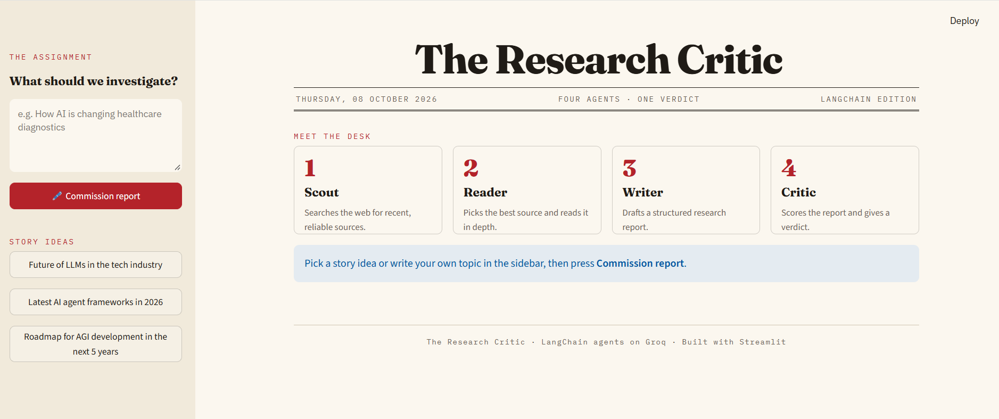

# LangChain-Research-Critic

A multi-agent research system built with LangChain: agents search the web, read sources, write a report, and a critic agent scores it with a verdict.



## How it works

| Step | Agent | What it does |
|---|---|---|
| 1 | **Scout** | Searches the web for recent, reliable sources (Tavily) |
| 2 | **Reader** | Picks the best source and scrapes it in depth |
| 3 | **Writer** | Drafts a structured research report |
| 4 | **Critic** | Scores the report out of 10 and gives a one-line verdict |

The LLM runs on [Groq](https://console.groq.com) (`openai/gpt-oss-120b`).

## Setup (uv)

```bash
git clone https://github.com/SajanPonnappa/LangChain-Research-Critic.git
cd LangChain-Research-Critic
uv sync                      # creates .venv and installs dependencies from uv.lock
cp .env.example .env         # then fill in your API keys
```

API keys needed in `.env`:
- `GROQ_API_KEY` — get one at https://console.groq.com/keys (free tier)
- `TAVILY_API_KEY` — get one at https://app.tavily.com (free tier)

## Run

```bash
uv run main.py                         # CLI
uv run python -m streamlit run app.py  # Streamlit UI at http://localhost:8501
```

## Project Structure

```
.
├── app.py              # Streamlit UI
├── main.py             # CLI entry point
├── pyproject.toml      # Project config + dependencies (managed by uv)
├── uv.lock             # Locked dependency versions
├── .python-version     # Python version used by uv
├── .env.example        # Template for API keys
├── .streamlit/         # UI theme
├── docs/               # Screenshots
└── src/
    ├── agents/         # Scout, reader, writer, critic agents
    ├── tools/          # web_search, scrape_url tools
    └── pipelines/      # Orchestrates the agents
```
